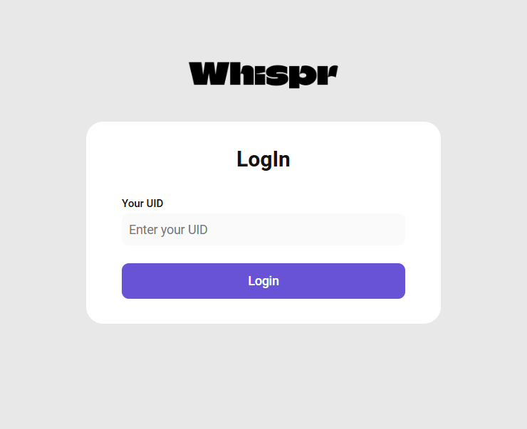

# Whispr

Whispr is a cutting-edge communication platform designed to facilitate seamless and secure messaging for individuals and teams. It offers a wide range of features to enhance your communication experience, making it the ideal choice for both personal and professional use.

## Table of Contents

- [Introduction](#introduction)
- [Features](#features)
- [Installation](#installation)
  - [Prerequisites](#prerequisites)
  - [Steps](#steps)
- [Usage](#usage)
- [Contributing](#contributing)
- [License](#license)
- [Contact](#contact)

## Introduction

Whispr aims to provide a secure and user-friendly messaging experience. With a focus on privacy and ease of use, Whispr is perfect for teams looking to collaborate effectively or individuals wanting to stay connected with friends and family.

## Features

- **End-to-End Encryption**: Ensures that all messages are secure and private, protecting your data from unauthorized access.
- **Cross-Platform**: Available on Windows, macOS, Linux, iOS, and Android, allowing you to stay connected across all your devices.
- **Group Chats**: Create and manage group conversations with ease, making it simple to collaborate with multiple people.
- **File Sharing**: Share documents, images, and other files securely, ensuring that your shared content remains private.
- **Voice and Video Calls**: High-quality voice and video calls with low latency, providing a smooth communication experience.
- **Custom Notifications**: Tailor notifications to your preferences, so you never miss an important message.

## Installation

### Prerequisites

Before you begin, ensure you have met the following requirements:

- **Node.js**: Version 14 or higher.
- **npm**: Version 6 or higher.

### Steps

Follow these steps to install and run Whispr:

1. **Clone the repository**:
   ```bash
   git clone https://github.com/yourusername/whispr.git
   ```
2. **Navigate to the project directory**:
   ```bash
   cd whispr
   ```
3. **Install dependencies**:
   ```bash
   npm install
   ```
   If you encounter issues during installation, ensure that your Node.js and npm versions are up to date.
4. **Start the application**:
   ```bash
   npm start
   ```

## Usage

Once the application is running, you can create an account or log in with your existing credentials. The intuitive interface allows you to:

- **Send Messages**: Start messaging your contacts instantly.
- **Create Groups**: Set up group chats for team collaboration.
- **Make Calls**: Initiate voice and video calls with ease.
- **Share Files**: Upload and share files securely.

### Example Usage

- To send a message, simply type in the message box and hit enter.
- To create a group, navigate to the groups section and follow the prompts.

## Contributing

We welcome contributions from the community. To contribute, follow these steps:

1. **Fork the repository**.
2. **Create a new branch**:
   ```bash
   git checkout -b feature-branch
   ```
3. **Make your changes**.
4. **Commit your changes**:
   ```bash
   git commit -m 'Add new feature'
   ```
5. **Push to the branch**:
   ```bash
   git push origin feature-branch
   ```
6. **Open a pull request**.

### Coding Standards

Please adhere to the following coding standards when contributing:
- Follow the project's coding style.
- Write clear and concise commit messages.
- Ensure that your code is well-documented.

## License

This project is licensed under the MIT License. See the [LICENSE](LICENSE) file for details.

## Screenshots

Here are some screenshots of the Whispr application:


<!--  -->



## Contact


For any questions or feedback, please reach out to us. We are here to help! You can also follow us on [Mail](mailto:kashiv.aradhya@gmail.com) for updates.
